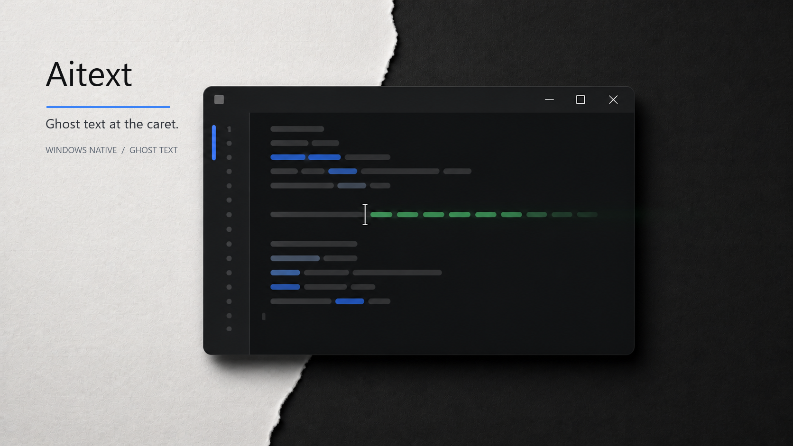
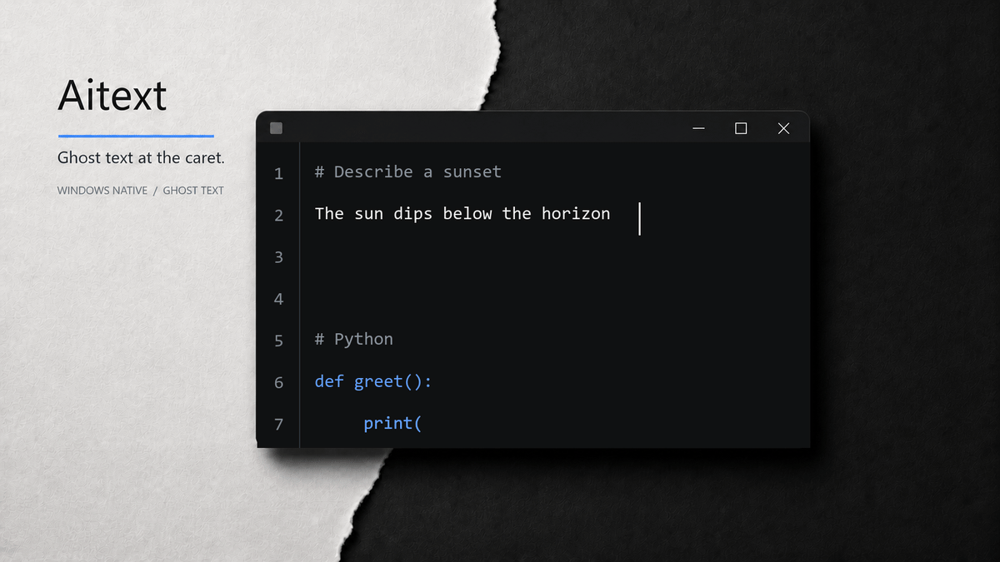

# Aitext

[English](README.md) · [简体中文](README.zh-CN.md)

[](https://github.com/naipi11/Aitext/actions/workflows/ci.yml) [](LICENSE) [](https://github.com/naipi11/Aitext/releases)





Aitext is a lightweight Windows-native text and code editor with one inline ghost-text continuation at the caret. It keeps the writing surface clear, supports Chinese IME, and connects to provider profiles without becoming an IDE or chat sidebar.

## Quick Start

### Install

Download the [Aitext installer](https://github.com/naipi11/Aitext/releases/latest/download/Aitext-Setup-0.1.0-win-x64.exe), or use the [portable ZIP](https://github.com/naipi11/Aitext/releases/latest/download/Aitext-Portable-0.1.0-win-x64.zip).

The v0.1.0 installer is unsigned, so Windows SmartScreen may show an unknown-publisher warning. Verify the download with [SHA256SUMS.txt](https://github.com/naipi11/Aitext/releases/latest/download/SHA256SUMS.txt) when needed.

### Configure a provider

1. Open **Settings** with `Ctrl+,`.
2. Choose **AI Profiles** and add or select a profile.
3. Set the provider, adapter, Base URL, model, and API key.
4. Save settings. API keys are stored with Windows DPAPI and are not written to `config.toml`.

DeepSeek, OpenAI, xAI/Grok, Anthropic/Claude, and custom endpoints are supported. Use FIM, Chat Completions, or Responses when the selected provider exposes that adapter.

### Use ghost text

Type in a document and pause briefly. A green continuation appears at the caret when a configured provider returns a suggestion.

- `Tab` accepts the visible suggestion.
- `Esc` dismisses it.
- Chinese IME composition remains separate from the document and stays anchored to the caret.

## Highlights

- Paper Cut shell with White, Black Green, VS Code, macOS Light, Dark, Lamp, High Contrast, and Custom themes.
- English, Simplified Chinese, and Follow Windows interface language modes.
- Multiple isolated API profiles and selectable models.
- Syntax highlighting for common source languages, tabs, find/replace, undo/redo, and configurable status information.
- Native Windows title controls and a portable single-process editor.

## Build from source

Install the stable Rust toolchain, then run:

```powershell
cargo test --workspace -- --test-threads=1
cargo build --release -p aitext
```

The portable executable is written to `target/release/aitext.exe`.

## Scope

Aitext is intentionally a focused editor. It does not include a file tree, LSP, debugger, terminal, plugin system, minimap, multi-caret editing, chat sidebar, Copilot login, or runtime translation downloads.

## License

MIT. Copyright 2026 naipi11.
