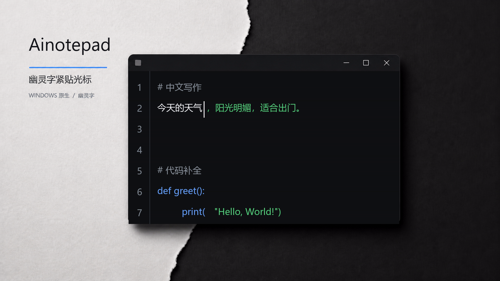
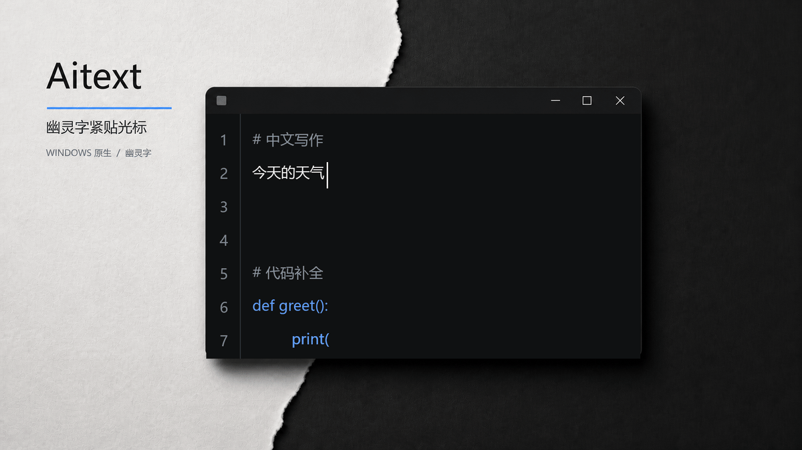

# Ainotepad

[English](README.md) · [简体中文](README.zh-CN.md)

[](https://github.com/naipi11/Ainotepad/actions/workflows/ci.yml) [](LICENSE) [](https://github.com/naipi11/Ainotepad/releases)





Ainotepad 是一款轻量级 Windows 原生文本/代码编辑器，在光标处提供一条幽灵字补全建议。它保持编辑区清晰，支持中文输入法，并通过配置文件连接大模型，不扩展成 IDE 或聊天侧栏。

## Quick Start / 快速开始

### 安装

下载 [Ainotepad 安装包](https://github.com/naipi11/Ainotepad/releases/latest/download/Ainotepad-Setup-0.1.0-win-x64.exe)，或使用[便携版 ZIP](https://github.com/naipi11/Ainotepad/releases/latest/download/Ainotepad-Portable-0.1.0-win-x64.zip)。

v0.1.0 安装包未进行代码签名，Windows SmartScreen 可能显示“未知发布者”提示。需要时可使用 [SHA256SUMS.txt](https://github.com/naipi11/Ainotepad/releases/latest/download/SHA256SUMS.txt) 校验下载文件。

### 配置模型服务

1. 使用 `Ctrl+,` 打开**设置**。
2. 进入 **AI 配置**，添加或选择一套配置。
3. 设置服务商、适配器、Base URL、模型和 API Key。
4. 保存设置。API Key 使用 Windows DPAPI 存储，不会写入 `config.toml`。

支持 DeepSeek、OpenAI、xAI/Grok、Anthropic/Claude 和自定义端点。根据服务商支持情况选择 FIM、Chat Completions 或 Responses 适配器。

### 使用幽灵字

在编辑区输入内容并短暂停顿。配置的模型返回建议后，绿色幽灵字会出现在光标处。

- `Tab` 接受当前建议。
- `Esc` 关闭当前建议。
- 中文输入法预编辑内容与正文分离，并且会跟随光标定位。

## 主要功能

- Paper Cut 外壳，支持白色、黑绿、VS Code、macOS 浅色、暗黑、纸灯、高对比度和自定义主题。
- English、简体中文、跟随 Windows 三种界面语言。
- 多套隔离 API 配置和可选模型列表。
- 新建文档默认使用 Markdown；底部文件类型选项框支持纯文本、C/C++、C#、Python、Rust、JavaScript/TypeScript、HTML、CSS、JSON、TOML、PowerShell、Batch 和 INI。
- 按当前文件类型提供语法高亮，并支持多标签、查找替换、撤销重做和可配置状态栏。
- 原生 Windows 标题栏和便携式单进程编辑器。

## 从源码构建

安装稳定版 Rust 工具链，然后运行：

```powershell
cargo test --workspace -- --test-threads=1
cargo build --release -p ainotepad
```

便携版可执行文件位于 `target/release/ainotepad.exe`。

## 项目边界

Ainotepad 有意保持专注，不包含文件树、LSP、调试器、终端、插件系统、迷你地图、多光标编辑、聊天侧栏、Copilot 登录或运行时翻译下载。

## 许可证

MIT。版权所有 2026 naipi11。
